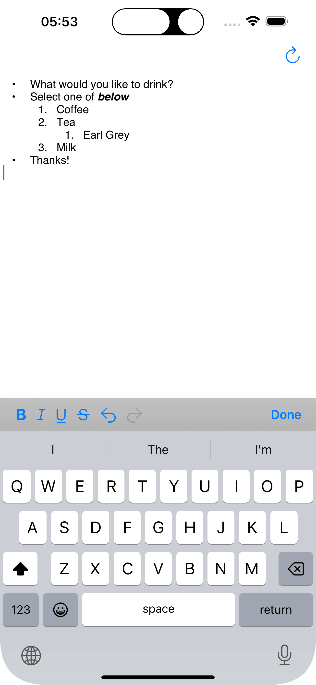

# NativeHtmlEditor

An html editor that supports converting between NSAttributedString and html.

|  |
|-|

## Editing Features:
- Bold
- Italic
- Underlined
- Strikethrough

## Html Converter Features:
- Bold
- Italic
- Underlined
- Link
- Text color
- Text background color
- Text alignment
- Strikethrough
- List Items

