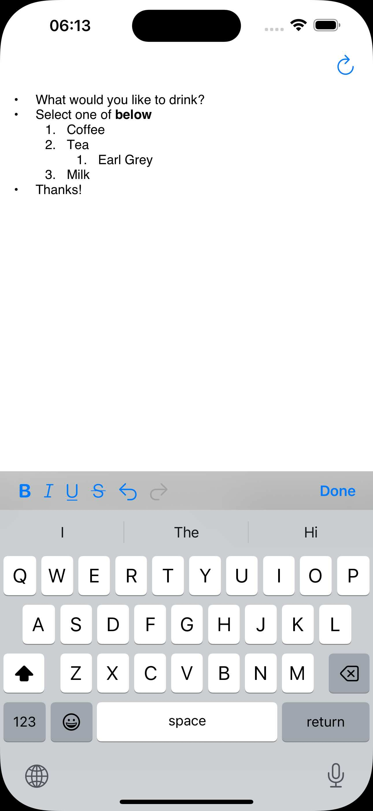

# NativeHtmlEditor

An html editor that supports converting between NSAttributedString and html.


| Editor View | Html Output |
|:---:|:---:|
|  |   |


## Editing Features:
- Bold
- Italic
- Underlined
- Strikethrough

## Html Converter Features:
- Bold
- Italic
- Underlined
- Link
- Text color
- Text background color
- Text alignment
- Strikethrough
- List Items

# Usage

```swift
  let paragraphs = [Paragraph](self.textView.attributedText!)
  let htmlTreeBuilder = HTMLTreeBuilder()
  for item in paragraphs {
      item.accept(visitor: htmlTreeBuilder)
  }
  let html = htmlTreeBuilder.toHtml()
```
